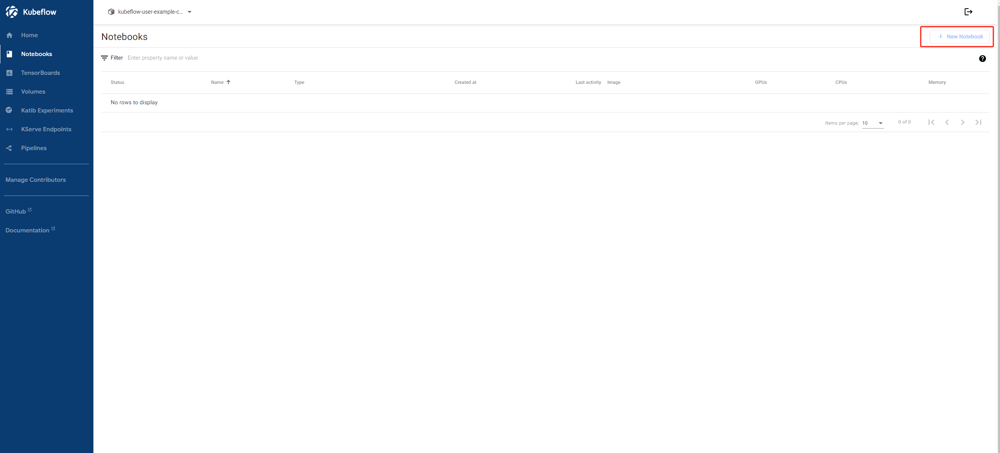
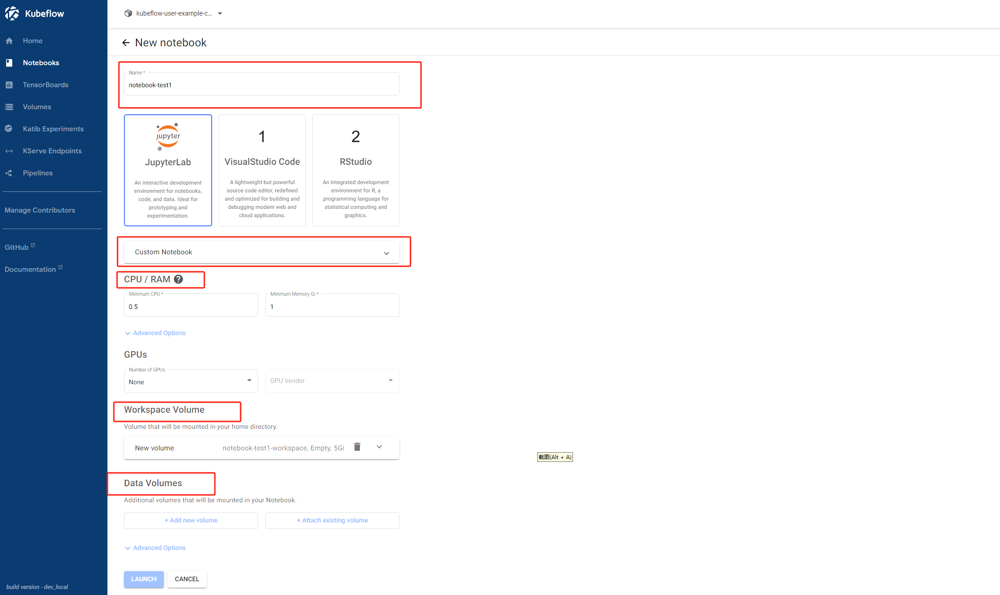
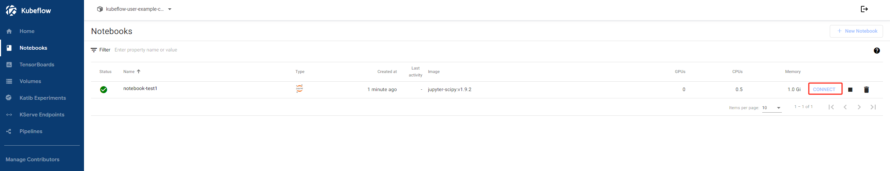
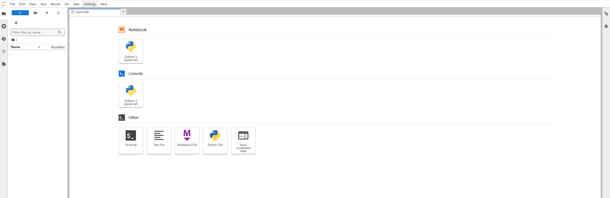

## 在kubeflow中构建自己的notebook服务

### 第一步

进入中央仪表台中找到Notebooks界面，点击“New Notebook”

### 第二步

配置notebook服务

| 配置项           | 描述                                     |
| ---------------- | ---------------------------------------- |
| Name             | notebook服务名称，默认不能重复           |
| Custom Notebook  | 可以选择已有的镜像，也可以配置个性化镜像 |
| CPU/RAM          | CPU和RAM资源按需求配置                   |
| GPUs             | GPU资源按需求配置                        |
| Workspace Valume | 工作空间，可以配置大小、权限、挂载路径等 |
| Data Volumes     | 数据空间，是工作空间的补充，默认不需要   |

### 第三步

创建成功过后，点击connect即可使用notebook服务

