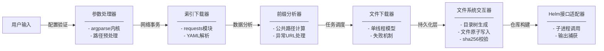
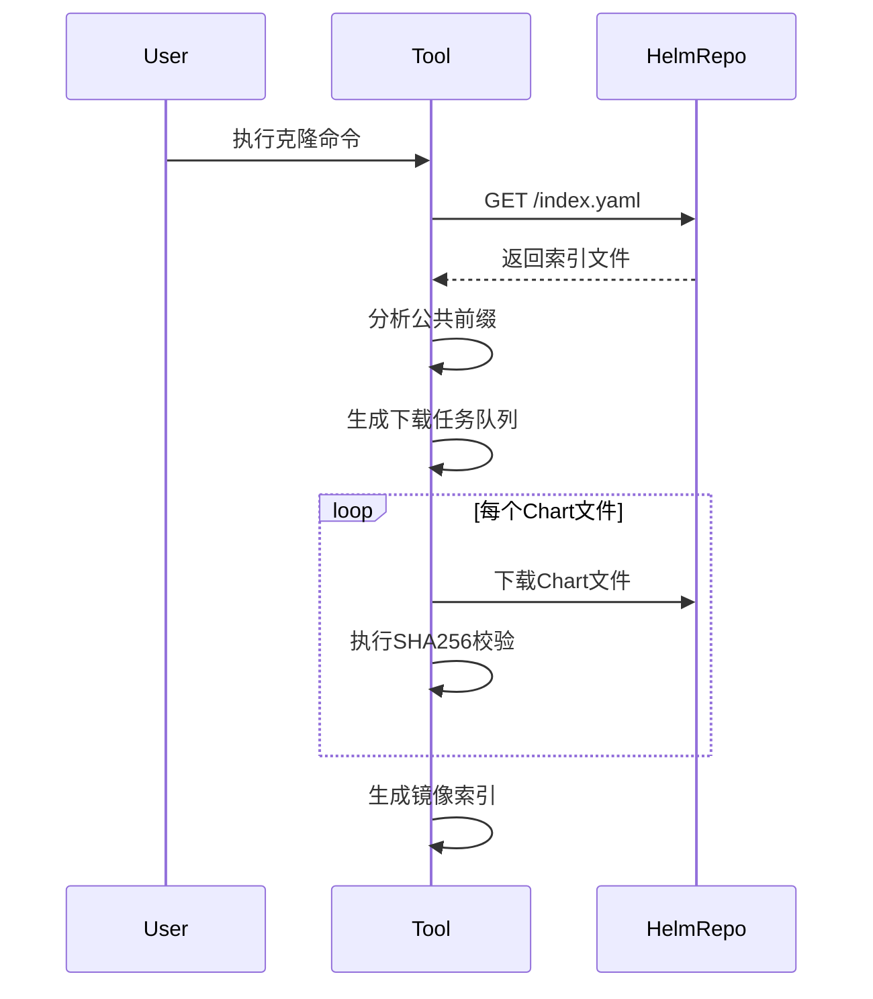

# Helm镜像仓库克隆工具设计文档

[TOC]

## 1. 背景与目标

### 1.1 背景
在企业级Kubernetes环境中，Helm作为标准的应用包管理工具面临两大挑战：
1. 生产环境通常需要离线部署
2. 公网Chart仓库访问不稳定

### 1.2 设计目标
- **全量镜像**：支持完整克隆源仓库的Chart及对应版本
- **智能路径分析**：自动识别URL公共前缀，构建合理目录结构
- **增量同步**：基于SHA256校验的智能同步机制
- **灵活配置**：提供多种运行模式和参数组合
- **生产就绪**：完善的错误重试与校验机制

## 2. 功能特性

| 类别     | 功能点                                                       |
| -------- | ------------------------------------------------------------ |
| 核心功能 | 完整仓库克隆、增量同步、索引文件生成                         |
| 智能处理 | 公共前缀自动检测、相对路径生成、文件完整性验证               |
| 运行模式 | 全量模式（默认）、仅下载模式（--no-index）、仅生成索引（--only-index） |
| 故障恢复 | 断点续传支持、按次数重试、智能跳过已完整文件                 |
| 输出控制 | 进度可视化（tqdm集成）、异常提示分级输出、运行结果统计       |
| 配置管理 | 本地存储路径定制、镜像URL覆盖、自定义前缀指定                |

## 3. 架构与模块设计

架构图：



### 3.1 核心模块分解

| 模块名称           | 功能描述                                                 |
| ------------------ | -------------------------------------------------------- |
| **参数处理器**     | 命令行参数解析、路径规范化、配置项有效性校验             |
| **索引下载器**     | 通过requests获取索引文件，进行YAML格式解析与异常初步检测 |
| **前缀分析器**     | 计算URL公共路径，在用户未指定前缀时智能提取前缀          |
| **文件下载器**     | 单线程HTTP下载实现，失败时进行重试                       |
| **文件系统交互器** | 实施写文件操作，执行二进制文件完整性校验                 |
| **Helm接口适配器** | 封装helm chart命令，捕获标准输出错误流                   |

### 3.2 命令行参数映射表

| 参数名称      | 类型   | 生效条件           | 字段作用域              | 默认值策略           |
| ------------- | ------ | ------------------ | ----------------------- | -------------------- |
| repo-url      | String | 必须提供           | 全局范围                | 无默认值             |
| --url         | URI    | index生成阶段      | index.yaml -> urls字段  | 空字符串（相对路径） |
| --path        | Path   | 文件下载与索引生成 | 本地文件系统操作根路径  | 当前路径             |
| --prefix      | String | URL转路径阶段      | urls字符串截取起始位置  | 自动分析算法         |
| --re-download | Flag   | 文件存在校验时     | 跳过校验强制覆盖        | False                |
| --no-index    | Flag   | 不与only-index共存 | 禁用helm repo index生成 | False                |
| --only-index  | Flag   | 不与no-index共存   | 跳过文件下载阶段        | False                |

## 4. 核心技术实现

### 4.1 索引文件处理流程


### 4.2 公共前缀检测算法

伪代码如下：

```python
function get_prefix(urls):
    normalized = []
    // 规范化处理每个URL
    for url in urls:
        str = url.replace(r'^https?://', '')  // 移除协议头
        segments = str.split('/')            // 按斜杠分割
        normalized.append(segments)
    
    prefix = []
    // 计算最小可用层级
    min_levels = min(len(p) for p in normalized)
    
    // 逐级比对路径段
    for level in 0...min_levels-1:
        current = normalized[0][level]
        match = True
        
        // 检查其他URL的当前层级
        for p in normalized[1:]:
            if p[level] != current:
                match = False
                break
        
        if not match:
            break
        else:
            prefix.append(current)
    
    return '/'.join(prefix)  // 拼接最终前缀
```

### 4.3 文件校验机制

- **本地存在检测**：基于文件存在性检查
- **SHA256校验**：通过sha256sum命令比对

规划中功能：

- **快速大小比对**（需服务端支持Content-Length）
- **多算法支持**（MD5/SHA1等）

## 5. 网络通信模型

- **流式传输**：使用requests的stream模式处理大文件
- **重试机制**：固定次数重试配置
- **进度显示**：集成tqdm实现实时进度条

规划中功能：

- **指数退避策略**：优化重试间隔算法
- **连接复用优化**：配置请求会话保持

## 6. 异常分类处理

| 异常类型         | 处理策略                                   |
| ---------------- | ------------------------------------------ |
| 网络连接失败     | 重试指定次数后抛出异常                     |
| 校验未通过       | 删除已下载文件并重试                       |
| 命令行工具缺失   | 立即终止，提示用户安装必要组件             |
| 索引文件格式错误 | 记录错误条目，跳过异常数据                 |
| 磁盘空间不足     | 提前检测可用空间（规划中功能），运行时监控 |
| 用户中断         | 捕获KeyboardInterrupt，清理临时文件        |

## 7. 性能优化措施

| 优化措施       | 实现状态 | 说明                       |
| -------------- | -------- | -------------------------- |
| 流式写入       | 实现     | 使用分块写入避免内存溢出   |
| 目录预创建     | 实现     | 按需创建目录树结构         |
| 文件存在性校验 | 实现     | 跳过已存在的有效文件       |
| 多线程下载     | 规划     | 支持并行下载加速           |
| 空间预分配     | 规划     | 提前分配磁盘空间提升IO性能 |

## 8. 安全设计

1. **完整性校验强制化**：
   - 每个下载文件必须通过SHA256校验
   - 校验失败时自动删除不完整文件
2. **路径注入防护**：
   - 使用os.path处理系统路径，避免拼接漏洞

规划中功能：

1. **GPG签名验证**：
   - 支持.prov文件的签名校验
2. **权限控制**：
   - 实现运行权限降级机制

## 9. 使用场景示例

### 9.1 典型完整部署
```bash
./helm-repo-builder.py https://charts.example.com/helm \
  --url https://mirror.example.com/helm \
  --path /path/to/helm-repo
```

### 9.2 分步执行
```bash
# 仅下载
python3 helm-repo-builder.py https://charts.example.com/helm \
  --path /path/to/helm-repo \
  --no-index

# 仅生成索引
python3 helm-repo-builder.py https://charts.example.com/helm \
  --url https://mirror.example.com/helm \
  --path /path/to/helm-repo \
  --only-index
```

## 10. 扩展性设计

### 10.1 多线程下载器（计划实现）

| 功能点   | 当前状态 | 技术难点                                    |
| -------- | -------- | ------------------------------------------- |
| 并行下载 | 规划     | 进度条同步显示、异常回滚机制                |
| 分块下载 | 规划     | 碎片合并校验、断点续传支持                  |
| 速率限制 | 规划     | 动态限速算法、单位换算（MB/s → byte/chunk） |

### 10.2 增强校验系统（计划实现）

```python
# 待实现功能列表：
GPG签名校验（需集成gpg命令行工具）
  - 读取Chart的prov文件
  - 公钥环管理子系统（待设计）

多算法支持（当前仅支持sha256）
  - 类型检测逻辑：digest字段前缀识别（如"md5:"/"sha1:"）
  - 动态调用校验程序（sha256sum/md5sum等）
```

## 11. 已知局限与改进计划

| 当前版本限制                 | 改进方案             |
| ---------------------------- | -------------------- |
| 单线程下载                   | 实现分片多线程下载   |
| 无磁盘空间预检查             | 增加预检模式         |
| 不支持Chart签名验证          | 集成GPG验证模块      |
| 索引合并逻辑依赖Helm CLI实现 | 自主实现索引合并逻辑 |

## 12. 附录

### 12.1 依赖说明
- **运行依赖**：
  
  - Python 3.6+
  - Helm客户端（需要包含`helm`命令）
- 系统工具：sha256sum
  
- **Python包依赖**：
  ```requirements
  requests >= 2.24.0
  pyyaml >= 5.3.1
  tqdm >= 4.46.0
  ```
